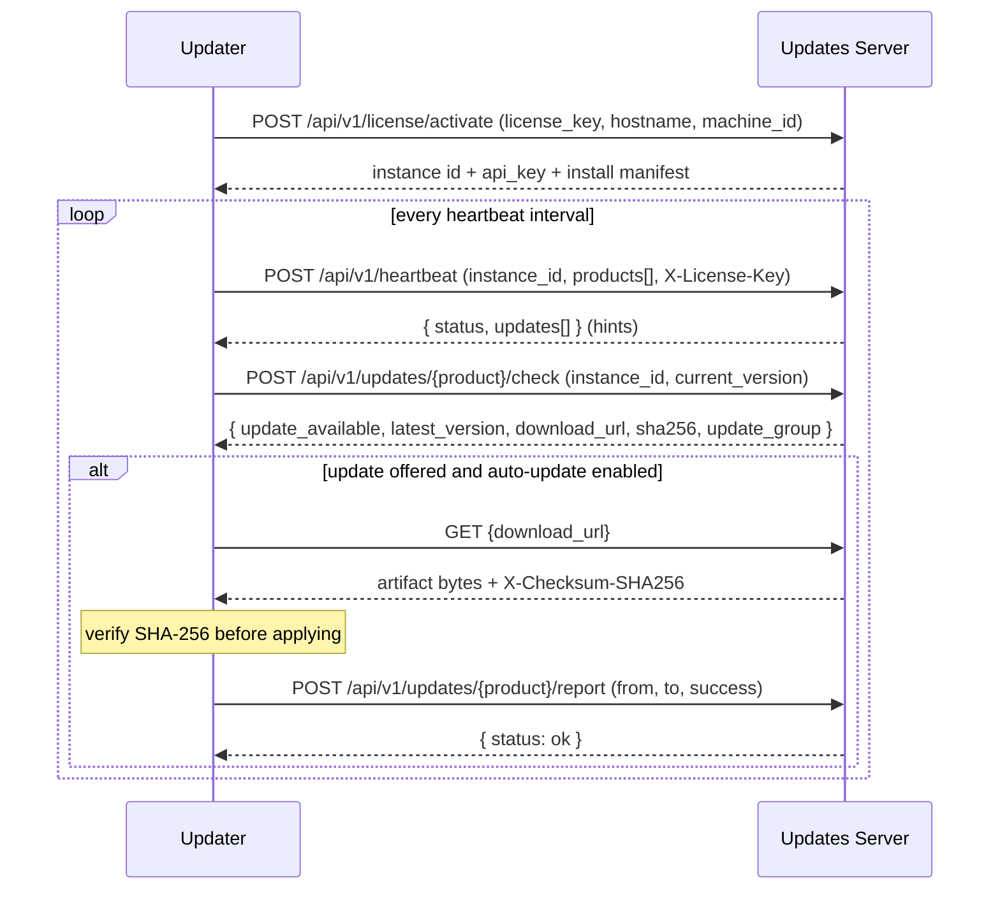

# MySoc Updates Server — API Contract

Authoritative HTTP API reference for the Updates Server that powers
`updates.mysoc.ai`. This document is generated from and kept in sync with the
Chi routes (`internal/server/api/server.go`), handlers
(`internal/server/api/handlers.go`), auth middleware
(`internal/server/api/middleware.go`), and shared types
(`pkg/types/types.go`). Where an endpoint's behavior is only partially
implemented, that is called out explicitly in
[Implemented vs Target](#8-implemented-vs-target-behavior).

## Revision History

| Version | Date       | Notes                                                        |
| ------- | ---------- | ------------------------------------------------------------ |
| 1.0.0   | 2026-08-12 | First authoritative contract, generated from server 1.3.0.1. |
| 1.8.0   | 2026-08-19 | Cascade distribution: mandatory `X-License-Key` on agent endpoints, ed25519 release signing + `GET /api/v1/signing-key`, operator admin API, heartbeat children rollup, relay protocol. See Section 9. |

---

## 1. Base URL and Versioning

| Environment | Base URL                        |
| ----------- | ------------------------------- |
| Production  | `https://updates.mysoc.ai`      |
| Local dev   | `http://localhost:8080`         |

- All versioned endpoints live under the `/api/v1` prefix.
- Two endpoints are served at the **root** (no `/api/v1`): `GET /health` and the
  direct binary download route `GET /{product}/{version}/{filename}`.
- The API is currently at **v1**. There is no separate version header; the
  version is encoded in the path. Breaking changes will be introduced under a
  new path prefix (`/api/v2`).
- The running build is reported by `GET /health` (`version` field, injected via
  `-ldflags` at build time — e.g. `1.3.0.1`).

---

## 2. Authentication Model

The server recognizes four access levels. Each endpoint in
[Section 5](#5-endpoint-reference) lists which one applies.

| Level              | Credential                                              | Header                                    |
| ------------------ | ------------------------------------------------------- | ----------------------------------------- |
| **Public**         | none                                                    | —                                         |
| **Admin**          | admin API key **or** an admin dashboard JWT             | `X-API-Key: <key>` or `Authorization: Bearer <jwt>` |
| **User (JWT)**     | any active dashboard user's access token                | `Authorization: Bearer <jwt>`             |
| **Admin (JWT)**    | dashboard user with `role = admin`                      | `Authorization: Bearer <jwt>`             |

### 2.1 Admin authorization (`adminAuth`)

Used for release mutations, instance mutations, and admin license **reads**.
It **fails closed** (`internal/server/api/middleware.go`):

- The API-key path is only available when `ADMIN_API_KEY` is configured on the
  server. If no key is configured, callers **must** present a valid admin JWT —
  authentication is never bypassed.
- API keys are accepted **only** from the `X-API-Key` header, never from the
  query string (which leaks into logs and referrers).
- Keys are compared with a constant-time comparison.
- Besides the static `ADMIN_API_KEY`, the `X-API-Key` header also accepts
  **managed API keys** (see [Section 2.5](#25-managed-api-keys)). Endpoints are
  authorized by **scope**: an `admin`-scoped key (or the static key, or an admin
  JWT) satisfies any endpoint; a `releases`-scoped key satisfies only the
  release-management endpoints. A valid key with an insufficient scope receives
  `403`.
- A presented-but-invalid `X-API-Key` is rejected with `401`; it does **not**
  fall through to the JWT path.
- Unauthenticated callers receive `401`; authenticated non-admin callers receive
  `403`.
- The JWT path requires an active user (`is_active = true`) with `role = admin`.

### 2.2 Dashboard JWTs

- Obtained via `POST /api/v1/auth/login` (+ `POST /api/v1/auth/mfa/verify` when
  MFA is enabled).
- Sent as `Authorization: Bearer <access_token>`.
- Access tokens are short-lived; refresh with `POST /api/v1/auth/refresh` using
  the refresh token. `expires_in` (seconds) is returned with the token.

### 2.3 License key (soft association header)

- `POST /api/v1/heartbeat` and `POST /api/v1/updates/{product}/check` accept an
  optional `X-License-Key` header.
- When present and valid, the server associates the reporting instance with that
  license. It is **not** currently required and does **not** reject the request
  when absent or invalid — see
  [Implemented vs Target](#8-implemented-vs-target-behavior).

### 2.4 IP allowlist (channel firewall)

When `IP_ALLOWLIST_ENFORCED=true`, the updater data-plane endpoints (heartbeat,
update check, report, artifact download) additionally require the request's
source IP to match an administrator-provisioned allowlist entry; otherwise the
request is rejected with `403`. This is independent of the credentials above and
is managed via [Section 5.10](#510-ip-allowlist-updater-channel-firewall). It
defaults to off.

### 2.5 Managed API keys

Administrators can mint named, scoped, revocable API keys from the dashboard
(**Settings → API Keys**) or the admin API
([Section 5.11](#511-api-keys-managed-credentials)). These let a team or CI
authenticate uploads without receiving the master `ADMIN_API_KEY`.

- Presented in the `X-API-Key` header, exactly like the static key.
- **Scopes:** `releases` (release management only — recommended for external
  teams) or `admin` (full admin surface, equivalent to `ADMIN_API_KEY`).
- Only the SHA-256 hash is stored; the full key (prefixed `msk_`) is returned
  **once** at creation and is unrecoverable afterward.
- Keys may carry an optional expiry and can be revoked at any time; revoked or
  expired keys are rejected as if unknown.

---

## 3. Conventions

- **Content type:** requests and responses are `application/json` unless noted
  (artifact download is `application/octet-stream`; release upload is
  `multipart/form-data`).
- **Timestamps:** RFC 3339 / ISO 8601 UTC (e.g. `2026-05-07T14:59:12.544656Z`).
  A never-set time serializes as Go's zero value `0001-01-01T00:00:00Z`; clients
  should treat that as "no expiry / not set".
- **Errors:** non-2xx responses use a flat object:

```json
{ "error": "human readable message" }
```

- **Compression:** responses may be gzip-compressed (`Accept-Encoding`).
- **CORS:** allowed methods `GET, POST, PUT, DELETE, OPTIONS`; allowed headers
  `Accept, Authorization, Content-Type, X-API-Key`. Allowed origins are
  server-configured.

---

## 4. The Updater Lifecycle (primary integration path)

This is the contract a product updater (SiemCore forwarder, SWF Windows service,
the reference simulator) implements. All four endpoints are **public** at the
transport level; identity is carried by `instance_id` and the optional
`X-License-Key` header.



**Integrity:** the artifact's SHA-256 is provided both in the check response
(`sha256`) and as the `X-Checksum-SHA256` response header on download. Updaters
MUST verify the checksum before applying. (Cryptographic signature verification
is **target**, not yet enforced — see Section 8.)

Worked, real examples for each step are in [Section 5](#5-endpoint-reference).

---

## 5. Endpoint Reference

### 5.1 Health

#### `GET /health` — Public

```bash
curl https://updates.mysoc.ai/health
```

```json
{ "status": "ok", "version": "1.3.0.1" }
```

---

### 5.2 Authentication — `/api/v1/auth`

| Method & Path                | Auth        | Purpose                              |
| ---------------------------- | ----------- | ------------------------------------ |
| `POST /auth/login`           | Public      | Password login (may require MFA)     |
| `POST /auth/mfa/verify`      | Public      | Complete MFA and receive tokens      |
| `POST /auth/refresh`         | Public      | Exchange refresh token for new pair  |
| `POST /auth/logout`          | User (JWT)  | Revoke current session               |
| `POST /auth/logout-all`      | User (JWT)  | Revoke all sessions                  |
| `GET  /auth/profile`         | User (JWT)  | Current user profile                 |
| `PUT  /auth/profile`         | User (JWT)  | Update name / avatar                 |
| `POST /auth/password`        | User (JWT)  | Change password                      |
| `GET  /auth/mfa/setup`       | User (JWT)  | Get TOTP secret + QR                 |
| `POST /auth/mfa/enable`      | User (JWT)  | Enable MFA after verifying a code    |
| `POST /auth/mfa/disable`     | User (JWT)  | Disable MFA                          |
| `GET  /auth/sessions`        | User (JWT)  | List active sessions                 |
| `GET  /auth/audit`           | User (JWT)  | Security audit log                   |

**`POST /auth/login`**

```json
{ "email": "admin@mysoc.ai", "password": "•••••••" }
```

Response (no MFA):

```json
{
  "requires_mfa": false,
  "access_token": "eyJ...",
  "refresh_token": "eyJ...",
  "expires_in": 900,
  "user": { "id": "…", "email": "admin@mysoc.ai", "name": "Admin", "role": "admin", "is_active": true }
}
```

Response (MFA required): `{ "requires_mfa": true, "mfa_token": "eyJ..." }`, then
`POST /auth/mfa/verify` with `{ "mfa_token": "…", "totp_code": "123456" }`
returns the same token shape as above.

**`POST /auth/refresh`** — `{ "refresh_token": "eyJ..." }` →
`{ "access_token": "…", "refresh_token": "…", "expires_in": 900 }`.

---

### 5.3 License — `/api/v1/license`

| Method & Path              | Auth   | Purpose                          |
| -------------------------- | ------ | -------------------------------- |
| `POST /license/activate`   | Public | Enroll: bind license to instance |
| `POST /license/validate`   | Public | Check license validity           |

**`POST /license/activate`** (enrollment)

```json
{ "license_key": "SIEM-XXXX-XXXX-XXXX-XXXX", "hostname": "edge-01", "machine_id": "abc123" }
```

Success `200`:

```json
{
  "success": true,
  "license": { "id": "…", "type": "siemcore", "products": ["siemcore"], "expires_at": "2027-01-01T00:00:00Z", "is_active": true },
  "instance": { "id": "siemcore-edge-01", "name": "edge-01", "api_key": "…" },
  "install": { "products": [{ "name": "siemcore", "version": "latest", "channel": "stable" }], "config_template": "", "security_baseline": "" }
}
```

Failure returns `400` with `{ "success": false, "error": "…" }`.

**`POST /license/validate`** — `{ "license_key": "SIEM-…" }` →
`{ "valid": true, "license": { … }, "expires_at": "2027-01-01T00:00:00Z" }`
(`404` with `{ "valid": false, "error": "license not found" }` when unknown).

---

### 5.4 Releases — `/api/v1/releases`

| Method & Path                                         | Auth   | Purpose                             |
| ----------------------------------------------------- | ------ | ----------------------------------- |
| `GET  /releases`                                      | Public | List all releases                   |
| `GET  /releases/{product}`                            | Public | List a product's releases           |
| `GET  /releases/{product}/latest`                     | Public | Latest release (legacy check)       |
| `GET  /releases/{product}/{version}`                  | Public | Release metadata                    |
| `GET  /releases/{product}/{version}/download`         | Public | Download artifact bytes             |
| `POST /releases`                                      | Admin  | Upload a new release (multipart)    |
| `PUT  /releases/{product}/{version}/{filename}`       | Admin  | Upload an extra arch binary         |
| `PUT  /releases/{product}/{version}/target-groups`    | Admin  | Set rollout target groups           |
| `PUT  /releases/{product}/{version}`                  | Admin  | Update notes and/or target groups   |
| `DELETE /releases/{product}/{version}`                | Admin  | Delete a release                    |

**`GET /releases/{product}/latest`** — supports `?channel=stable` and
`?current_version=v2.0.0` query params. Returns a `ReleaseInfo`
([Section 7.2](#72-releaseinfo)) with `update_available` computed against
`current_version`.

**`GET /releases/{product}/{version}/download`** — streams
`application/octet-stream` with headers:

- `Content-Disposition: attachment; filename=<file>`
- `Content-Length: <bytes>`
- `X-Checksum-SHA256: <sha256>`

**`POST /releases`** (multipart/form-data) fields:

| Field           | Required | Notes                                                     |
| --------------- | -------- | --------------------------------------------------------- |
| `artifact`      | yes      | The file (max 500 MB)                                     |
| `product`       | yes      | Product name                                              |
| `version`       | yes      | Release version (e.g. `v2.0.270`)                         |
| `channel`       | no       | Defaults to `stable`                                      |
| `release_notes` | no       | Free text                                                 |
| `target_groups` | no       | Comma-separated **or** `target_groups[]` repeated. Valid: `alpha`, `beta`, `stable`, `production` |

```bash
curl -X POST https://updates.mysoc.ai/api/v1/releases \
  -H "X-API-Key: $ADMIN_API_KEY" \
  -F artifact=@siemcore-v2.0.270-linux-amd64.tar.gz \
  -F product=siemcore -F version=v2.0.270 -F channel=stable \
  -F 'target_groups=alpha,beta'
```

Returns `201` with the created `Release` ([Section 7.1](#71-release)).

---

### 5.5 Direct Download (root) — Public

#### `GET /{product}/{version}/{filename}`

Serves a stored binary directly (SiemCore installer format), e.g.
`GET /siemcore/v1.5.0/siemcore-linux-amd64`. Sets `X-Checksum-SHA256` when a
matching release checksum is on record. `404` when the file is not in storage.
(`product` values `api` and `health` are reserved and 404 here.)

---

### 5.6 Heartbeat — Public

#### `POST /api/v1/heartbeat`

Optional header: `X-License-Key: SIEM-…` (associates the instance to a license).
Body is a `Heartbeat` ([Section 7.3](#73-heartbeat)); at minimum `instance_id`
and `products[]` are meaningful.

```json
{
  "instance_id": "sim-e2e-20260811",
  "instance_type": "siemcore-linux",
  "product_tier": "siemcore",
  "parent_instance_id": "sim-mysoc-dev-01",
  "hostname": "sim-e2e-20260811",
  "updater_version": "updater-simulator/1.3.0.1",
  "products": [{ "name": "siemcore", "version": "v2.0.0", "channel": "stable" }],
  "timestamp": "2026-08-11T20:42:13Z"
}
```

`product_tier` (`mysoc`|`siemcore`|`swf`) and `parent_instance_id` are optional
self-reported hierarchy fields ([Section 4.4 of the guidelines](UPDATER-GUIDELINES.md)).
When `product_tier` is supplied it must be canonical; if the declared parent
already exists its tier must be exactly one rank above (else `400`). An unknown
parent is accepted and reconciled later (orphan). `instance_type` stays the
OS/sub-type.

Response `200` — the server upserts the instance and returns update hints for
every product that has a newer release:

```json
{
  "status": "ok",
  "updates": [
    { "product": "siemcore", "latest_version": "v2.0.269", "update_available": true, "channel": "stable", "download_url": "/api/v1/releases/siemcore/v2.0.269/download", "checksum": "0ea72f…", "size": 21091003 }
  ]
}
```

> Note: heartbeat hints are **not** update-group aware; they reflect the latest
> release for the channel. The group-aware decision is made by
> `updates/{product}/check` (below).

---

### 5.7 Updates — `/api/v1/updates`

| Method & Path                          | Auth   | Purpose                                  |
| -------------------------------------- | ------ | ---------------------------------------- |
| `POST /updates/{product}/check`        | Public | Group-aware update decision              |
| `POST /updates/{product}/report`       | Public | Report install success/failure/rollback  |

**`POST /updates/{product}/check`** — optional `X-License-Key` header. Body
(`UpdateCheckRequest`):

```json
{
  "instance_id": "sim-e2e-20260811",
  "current_version": "v2.0.0",
  "updater_version": "updater-simulator/1.3.0.1",
  "os": "linux", "arch": "amd64",
  "hostname": "sim-e2e-20260811",
  "channel": "stable",
  "product_tier": "siemcore",
  "parent_instance_id": "sim-mysoc-dev-01"
}
```

`product_tier` and `parent_instance_id` are optional (same hierarchy rules as the
heartbeat). If `product_tier` is omitted it defaults to `{product}` when that
path segment names a canonical tier.

The server upserts the instance, honors its `auto_update_enabled` flag, and
selects the newest release visible to the instance's **update group**
(`alpha`/`beta`/`stable`/`production`, defaulting to `stable`).

Update available `200`:

```json
{
  "update_available": true,
  "latest_version": "v2.0.269",
  "download_url": "https://updates.mysoc.ai/api/v1/releases/siemcore/v2.0.269/download",
  "update_url":   "https://updates.mysoc.ai/api/v1/releases/siemcore/v2.0.269/download",
  "sha256": "0ea72f151757a65c0f3fd75d03e8b2040af9c8969359e43d02eb33d84311884a",
  "release_notes": "…",
  "channel": "stable",
  "update_group": "stable"
}
```

Up to date `200`:
`{ "update_available": false, "current_version": "v2.0.269", "update_group": "stable" }`

Auto-update disabled `200`:
`{ "update_available": false, "current_version": "…", "auto_update": false }`

**`POST /updates/{product}/report`** (`UpdateReportRequest`):

```json
{ "instance_id": "sim-e2e-20260811", "from_version": "v2.0.0", "to_version": "v2.0.269", "success": true }
```

Optional fields: `error` (on failure), and the simulator additionally sends
`kind` (`artifact` | `reconcile`) and `stage` for monitoring; unknown fields are
ignored. Response `200`:
`{ "status": "ok", "message": "update report received" }`.

> Rollback reporting uses the same endpoint: report `success: false` with an
> `error`, and (once applied) a follow-up report reflecting the restored
> `to_version`.

---

### 5.8 Instances — `/api/v1/instances`

| Method & Path                          | Auth        | Purpose                       |
| -------------------------------------- | ----------- | ----------------------------- |
| `GET  /instances`                      | User (JWT)  | List all instances            |
| `GET  /instances/paged`                | User (JWT)  | Paginated list                |
| `GET  /instances/tree`                 | User (JWT)  | Fleet as an operator → customer tier tree |
| `GET  /instances/{id}`                 | User (JWT)  | Instance detail               |
| `PUT  /instances/{id}`                 | Admin       | Update display/auto-update/group |
| `DELETE /instances/{id}`               | Admin       | Delete instance               |
| `PUT  /instances/{id}/auto-update`     | Admin       | Toggle auto-update            |
| `PUT  /instances/{id}/update-group`    | Admin       | Set update group              |

- `GET /instances/paged?limit=50&offset=0` — `limit` clamped to `1..200`
  (default 50), `offset ≥ 0` (default 0). Returns `{ items, total, limit, offset }`.
- `PUT /instances/{id}` body (`UpdateInstanceRequest`): any of
  `display_name`, `auto_update_enabled`, `update_group`. Empty body → `400 no fields to update`.
- `PUT /instances/{id}/auto-update` → `{ "enabled": true }`.
- `PUT /instances/{id}/update-group` → `{ "group": "beta" }`
  (must be `alpha`/`beta`/`stable`/`production`).

**`GET /instances/tree`** mirrors the sales hierarchy. A SOC operator owns the
mysoc platform; its customers (added directly or via a reseller) each hold a
license covering their siemcore server(s) and swf forwarders. The response
groups the fleet per operator, using each node's self-reported `product_tier`
and `parent_instance_id`:

```json
{
  "operators": [
    {
      "operator_id": "cyfox-soc", "operator_name": "Cyfox SOC", "total_nodes": 3,
      "platform_roots": [
        { "instance_id": "mysoc-prod-01", "product_tier": "mysoc", "status": "online", "children": [] }
      ],
      "customers": [
        {
          "license_id": "…", "license_key": "SIEM…A9C9", "customer_name": "Acme",
          "reseller_id": "chan-1", "reseller_name": "Acme Channel Ltd",
          "total_nodes": 2,
          "roots": [
            {
              "instance_id": "sim-siemcore-dev-01", "product_tier": "siemcore",
              "parent_instance_id": "mysoc-prod-01", "status": "online",
              "children": [
                { "instance_id": "sim-swf-dev-01", "product_tier": "swf", "parent_instance_id": "sim-siemcore-dev-01", "status": "online", "children": [] }
              ]
            }
          ]
        }
      ]
    }
  ]
}
```

Semantics:

- A license is a **platform license** (defines an operator) when its `type` is
  `mysoc-cloud` or its `operator_id` equals its own `customer_id`; those
  instances appear under `platform_roots`. All other licenses are customer
  licenses, grouped under the operator named by their `operator_id`.
- Parent links resolve **across licenses**: a customer's siemcore that declares
  the operator's mysoc as parent is a normal customer root (not an orphan).
  `"orphan": true` now means the declared parent is not enrolled anywhere.
- Customer licenses appear even before any instance enrolls (empty `roots`).
- `license_key` is masked. Licenses without an `operator_id` and instances with
  no bound license fall under the `"Unassigned"` operator (the latter in an
  `"Unlicensed / unbound"` bucket).
- Reseller fields are sales metadata only; resellers deploy no software.

**`GET /api/v1/products`** (public) returns the canonical tier catalog for
dropdowns: `{ "tiers": [ { "name": "mysoc", "display_name": "MySoc", "rank": 0 }, { "name": "siemcore", …, "rank": 1, "parent_tier": "mysoc" }, { "name": "swf", …, "rank": 2, "parent_tier": "siemcore" } ] }`.

---

### 5.9 Admin — `/api/v1/admin`

| Method & Path                     | Auth         | Purpose                    |
| --------------------------------- | ------------ | -------------------------- |
| `GET  /admin/licenses`            | Admin        | List licenses              |
| `GET  /admin/licenses/{id}`       | Admin        | Get license                |
| `POST /admin/licenses`            | Admin (JWT)  | Create license             |
| `PUT  /admin/licenses/{id}`       | Admin (JWT)  | Update license             |
| `DELETE /admin/licenses/{id}`     | Admin (JWT)  | Delete license             |
| `GET  /admin/ip-allowlist`        | Admin        | List IP allowlist entries  |
| `POST /admin/ip-allowlist`        | Admin        | Add an allowlist entry     |
| `DELETE /admin/ip-allowlist/{id}` | Admin        | Remove an allowlist entry  |
| `GET  /admin/users`               | Admin (JWT)  | List users                 |
| `POST /admin/users`               | Admin (JWT)  | Create user                |
| `GET  /admin/users/{id}`          | Admin (JWT)  | Get user                   |
| `PUT  /admin/users/{id}`          | Admin (JWT)  | Update user                |
| `DELETE /admin/users/{id}`        | Admin (JWT)  | Delete user                |

> Note the asymmetry: license **reads** accept the admin API key (`adminAuth`),
> while license **writes** and all user management require an **admin JWT**
> (`role = admin`) — an API key alone cannot create/update/delete licenses or
> users.

**`POST /admin/licenses`** (`CreateLicenseRequest`):

```json
{
  "customer_id": "acme",
  "customer_name": "ACME Corp",
  "type": "siemcore",
  "operator_id": "cyfox-soc",
  "reseller_id": "chan-1",
  "reseller_name": "Acme Channel Ltd",
  "products": ["siemcore"],
  "features": ["cluster"],
  "limits": { "max_events_per_day": 1000000, "max_users": 25, "max_data_sources": 50, "max_retention_days": 90 },
  "expires_at": "2027-01-01T00:00:00Z"
}
```

`customer_id`, `customer_name`, and `type` are required. `prefix` defaults to
`MYSOC` for `type = mysoc-cloud`, otherwise `SIEM`. Ownership fields are
optional: `operator_id` ties a customer license to its SOC operator (on a
`mysoc-cloud` platform license it defaults to the license's own
`customer_id`); `reseller_id`/`reseller_name` record the sales channel and stay
empty for direct sales. `PUT /admin/licenses/{id}` accepts partial updates of
`customer_name`, `is_active`, `operator_id`, `reseller_id`, `reseller_name`.
Returns `201` with the created `License`.

---

### 5.10 IP Allowlist (updater channel firewall)

The IP allowlist locks the updater **data-plane** channel (heartbeat, update
check, report, and artifact download) to known source addresses. It is an
allowlist-only control with no trust-on-first-use: an administrator provisions
the entries.

- **Enforcement is gated by the server env var `IP_ALLOWLIST_ENFORCED`** (default
  `false`). When `false`, entries can be managed but are not enforced, so
  existing fleets are unaffected until you opt in.
- An entry with an `instance_id` applies to that instance only; an entry without
  one is **global** and applies to every instance **and** to the instance-less
  artifact-download endpoints.
- When enforced, a request whose source IP matches no applicable entry is
  rejected with `403 { "error": "source address not allowed" }` and the denial
  is logged server-side.
- The source IP is derived from `X-Real-IP` / `X-Forwarded-For` (set by a trusted
  reverse proxy such as the production nginx) or the direct connection. Only put
  the server behind a proxy you control.
- Management endpoints (`/admin/*`, including these) are **not** IP-gated — they
  are protected by admin authorization — so you cannot lock yourself out of
  administration.

**`GET /admin/ip-allowlist`**

```json
{
  "enforced": true,
  "entries": [
    { "id": "65ce7bed-…", "cidr": "127.0.0.1/32", "note": "local e2e", "created_at": "2026-08-13T13:48:04Z" },
    { "id": "a1b2…", "instance_id": "siemcore-edge-01", "cidr": "203.0.113.0/24", "note": "branch office", "created_at": "…" }
  ]
}
```

**`POST /admin/ip-allowlist`** (`CreateIPAllowlistRequest`)

```json
{ "instance_id": "siemcore-edge-01", "cidr": "203.0.113.0/24", "note": "branch office" }
```

- `cidr` (required): a bare host (`203.0.113.7`, `::1`) or a CIDR range
  (`10.0.0.0/8`, `2001:db8::/32`), IPv4 or IPv6. CIDRs are stored canonicalized.
- `instance_id` (optional): omit for a global entry.

Returns `201` with the created entry. Invalid CIDRs return `400`.

**`DELETE /admin/ip-allowlist/{id}`** → `200 { "status": "deleted" }` (or `404`).

---

### 5.11 API keys (managed credentials)

Managed API keys (see [Section 2.5](#25-managed-api-keys)) authenticate via the
`X-API-Key` header and are authorized by scope. Managing keys is a **full-admin**
action (static `ADMIN_API_KEY` or an admin JWT).

| Endpoint                        | Auth  | Description                         |
| ------------------------------- | ----- | ----------------------------------- |
| `GET    /admin/api-keys`        | Admin | List keys (metadata only, no value) |
| `POST   /admin/api-keys`        | Admin | Create a key; returns value **once**|
| `DELETE /admin/api-keys/{id}`   | Admin | Revoke a key                        |

**`POST /admin/api-keys`** (`CreateAPIKeyRequest`)

```json
{ "name": "SWF release upload", "scope": "releases", "expires_in_days": 90 }
```

- `name` (required): human label shown in the dashboard.
- `scope` (optional): `releases` (default) or `admin`.
- `expires_in_days` (optional): omit or `0` for no expiry.

Returns `201`; the full key is present **only** in this response:

```json
{
  "api_key": "msk_9f3c1a2b7d4e…",
  "key": {
    "id": "b7c2…", "name": "SWF release upload", "key_prefix": "msk_9f3c1a2b",
    "scope": "releases", "created_by": "admin@mysoc.ai",
    "created_at": "2026-08-18T12:40:00Z", "expires_at": "2026-11-16T12:40:00Z",
    "status": "active"
  },
  "warning": "Store this key now — it is shown only once and cannot be retrieved later."
}
```

**`GET /admin/api-keys`** → `{ "keys": [ { …metadata…, "status": "active|expired|revoked" } ] }`
(never includes the key value; `key_prefix` is a non-sensitive display hint).

**`DELETE /admin/api-keys/{id}`** → `200 { "status": "revoked" }` (or `404`).
Revocation is immediate and permanent.

**Upload with a scoped key** (what an external team uses):

```bash
curl -X POST https://updates.mysoc.ai/api/v1/releases \
  -H "X-API-Key: msk_9f3c1a2b7d4e…" \
  -F "product=swf" -F "version=v2.2.0" -F "channel=stable" \
  -F "artifact=@SiemCoreWinForwarder-2.2.0.exe"
```

---

## 6. HTTP Status Codes

| Code | Meaning in this API                                                        |
| ---- | ------------------------------------------------------------------------- |
| 200  | Success                                                                    |
| 201  | Created (release upload, license/user creation)                           |
| 400  | Malformed body, missing required field, or invalid enum (e.g. bad group)  |
| 401  | Missing/invalid credentials (unauthenticated)                             |
| 403  | Authenticated but insufficient role (non-admin on admin route)            |
| 404  | Resource not found (unknown release/instance/license/artifact)            |
| 500  | Server-side error                                                         |

All error bodies are `{ "error": "message" }`.

---

## 7. Data Models

Field names are the JSON keys emitted by the server (`pkg/types/types.go`).

### 7.1 Release

`id, product_name, version, channel, manifest{product,version,channel,artifacts[],dependencies[],changelog}, artifact_size, checksum, signature?, release_notes?, min_updater_version?, target_groups[], released_at, created_at`.
Each `artifact`: `{ name, arch, size, checksum }`.

### 7.2 ReleaseInfo

`product, current_version?, latest_version, update_available, channel, download_url, checksum, size, release_notes?, released_at`.

### 7.3 Heartbeat

`instance_id, instance_type, product_tier?, parent_instance_id?, hostname, updater_version, config_hash, license{key,valid,expires_at,last_check}, products[], system{os,arch,cpu_usage,memory_*,disk_*,load_average,uptime}, security{…}?, timestamp, last_update_attempt?{from_version,target_version,success,error?,timestamp}`.
Each `product` (`ProductStatus`): `{ name, version, channel, status, uptime, last_restart, pid?, health_endpoint?, health_status? }`.

### 7.4 Instance

`id, instance_id, instance_type, product_tier?, parent_instance_id?, hostname, display_name?, license_id?, last_heartbeat?, last_heartbeat_data?, status, auto_update_enabled, update_group, last_ip_address?, last_ip_seen_at?, last_update_from_version?, last_update_target_version?, last_update_success?, last_update_error?, last_update_at?, created_at, updated_at`.

### 7.5 License

`id, license_key, customer_id, customer_name, type, operator_id?, reseller_id?, reseller_name?, products[], features?, limits{max_events_per_day,max_users,max_data_sources,max_retention_days}, issued_at, expires_at, bound_to?, is_active, created_at, updated_at`.

### 7.6 User

`id, email, name, role, avatar_url?, mfa_enabled, is_active, email_verified, last_login_at?, password_changed_at, created_at, updated_at`. `role ∈ {admin, operator, viewer}`.

---

## 8. Implemented vs Target Behavior

This section is the honest edge — what the deployed server does **today** versus
what a hardened updater contract should eventually guarantee. It maps directly to
the SWF team's request.

| Capability                              | Status        | Notes                                                                                          |
| --------------------------------------- | ------------- | ---------------------------------------------------------------------------------------------- |
| Enrollment (`license/activate`)         | Implemented   | Returns instance id + api_key + install manifest.                                              |
| Heartbeat + update offers               | Implemented   | `heartbeat` (channel-latest hints) and `updates/{product}/check` (group-aware decision).       |
| Artifact download                       | Implemented   | Public; `X-Checksum-SHA256` header + `sha256` in check response.                               |
| SHA-256 integrity                       | Implemented   | Checksum published and verifiable; updaters MUST verify before applying.                       |
| Success/failure/rollback reporting      | Partial       | `updates/{product}/report` **acknowledges** but does not yet persist reports for analytics.    |
| Device auth on heartbeat/check          | Implemented (1.8.0) | `X-License-Key` is **required** and validated (active + unexpired) on heartbeat, update check/report, and downloads. Product-scoped keys also constrain the claimed tier. |
| Source IP allowlist (channel firewall)  | Implemented   | Allowlist-only, admin-managed per-instance/global IP/CIDR entries; env-gated by `IP_ALLOWLIST_ENFORCED` (default off). Rejects unlisted sources with `403`. See 5.10. |
| Instance API key validation             | Target        | `instanceAuth` currently only checks the key is non-empty (no DB validation).                  |
| Cryptographic release signatures        | Implemented (1.8.0) | Releases are ed25519-signed at publish when `RELEASE_SIGNING_SEED` is set; signature is returned in check responses and the `X-Signature-Ed25519` download header. Updaters with `signing.public_key` configured verify before install. |
| Signing keys + key rotation             | Partial (1.8.0) | Single active key published at `GET /api/v1/signing-key`. Rotation = new seed + re-publish; no multi-key trust set yet. |
| Grant claiming / lease / idempotency    | Target        | No explicit grant object; the offer is stateless per check. Idempotency is by `instance_id` + version. |
| Download resume (range requests)        | Target        | Full-body download only; no `Range`/`Content-Range` support.                                    |
| Maintenance windows / approval gates    | Partial       | Rollout via channel + `target_groups` + per-instance `auto_update_enabled`/`update_group`; no time-window fields. |
| API versioning + standard error codes   | Implemented   | `/api/v1` prefix; error shape `{ "error": … }`; status codes per Section 6.                     |
| Proxy / enterprise CA support           | Deployment    | Standard HTTPS via nginx; honors `X-Forwarded-Proto`/`X-Real-IP`. CA trust is client-side.      |

---

## 9. Cascade Distribution (added in 1.8.0)

Starting with 1.8.0 the fleet is served through a **cascade of updaters**
instead of every node talking to `updates.mysoc.ai` directly:

```
updates.mysoc.ai  ←  mysoc updater (relay)  ←  siemcore updater (relay)  ←  swf updater (leaf)
```

Only mysoc-tier updaters connect to the updates server. Each relay exposes
the same four data-plane endpoints to its children, so a child updater does
not know or care whether its parent is the central server or another relay.

### 9.1 Agent authentication (breaking change)

All agent data-plane endpoints now **require** a valid `X-License-Key`:

- `POST /api/v1/heartbeat`
- `POST /api/v1/updates/{product}/check`
- `POST /api/v1/updates/{product}/report`
- `GET  /api/v1/releases/{product}/{version}/download` and the root direct
  download route

Missing, unknown, deactivated, or expired keys are rejected with `401`.
New-style keys carry a `product` scope; a key scoped to `mysoc` covers the
whole cascade beneath it (siemcore, swf). Heartbeats claiming a tier the key
does not authorize are rejected with `403`.

### 9.2 Operators and platform keys — `/api/v1/admin/operators`

An **operator** is a SOC operator running a mysoc platform. Each operator
gets exactly one platform license key; that single key is the credential the
operator's mysoc updater uses against `updates.mysoc.ai`.

| Method | Path                                  | Auth        | Purpose |
| ------ | ------------------------------------- | ----------- | ------- |
| GET    | `/api/v1/admin/operators`             | admin       | List operators with key metadata and fleet counts. |
| POST   | `/api/v1/admin/operators`             | admin (JWT) | Create operator; issues the platform key (returned **once**). |
| POST   | `/api/v1/admin/operators/{id}/rotate-key` | admin (JWT) | Revoke the current key and issue a new one (returned once). |
| PUT    | `/api/v1/admin/operators/{id}`        | admin (JWT) | Rename or activate/deactivate. Deactivating cuts off the operator's whole cascade. |

### 9.3 Release signing — `GET /api/v1/signing-key`

- When `RELEASE_SIGNING_SEED` (hex ed25519 seed) is configured, every
  published release is signed over `"mysoc-release-v1\n{product}\n{version}\n{sha256}"`.
- `GET /api/v1/signing-key` (public) returns `{ "algorithm": "ed25519", "public_key": "<hex>" }`.
- The signature travels in `ReleaseInfo.signature` (base64) in check
  responses and in the `X-Signature-Ed25519` response header on downloads.
- Updaters configured with `signing.public_key` MUST verify the signature
  (and the SHA-256 checksum) before applying an update, at **every** hop.

### 9.4 Heartbeat rollup (`children`)

A relay's own heartbeat MAY include a `children` array of `ChildReport`
objects — the telemetry of every node it serves, nested recursively:

```json
{
  "instance_id": "mysoc-op1",
  "product_tier": "mysoc",
  "children": [
    {
      "instance_id": "siemcore-a", "product_tier": "siemcore",
      "customer_id": "acme", "customer_name": "Acme Corp",
      "status": "online", "last_seen": "2026-08-19T12:00:00Z",
      "children": [
        { "instance_id": "swf-pc7", "product_tier": "swf", "customer_id": "acme",
          "status": "online", "last_seen": "2026-08-19T11:59:30Z" }
      ]
    }
  ]
}
```

The server upserts each reported node into `instances` with
`reported_via` = the relay's instance id and `reported_at` = rollup receipt
time. A direct heartbeat from a node always wins over an older rollup entry.
Rollups are capped at 2000 nodes per heartbeat.

### 9.5 Relay child protocol

A relay (updater in relay mode) serves its children on:

| Method | Path | Notes |
| ------ | ---- | ----- |
| GET    | `/health` | Liveness. |
| POST   | `/api/v1/heartbeat` | Enrolls/refreshes a child. First contact returns a `relay_token`; the child MUST persist it and send it as `X-Relay-Token` on subsequent requests. |
| POST   | `/api/v1/updates/{product}/check` | Forwarded upstream; download URLs are rewritten to the relay; `signature` passes through unchanged. |
| POST   | `/api/v1/updates/{product}/report` | Recorded into the relay's rollup. |
| GET    | `/api/v1/releases/{product}/{version}/download` | Served from the relay's pull-through cache; artifacts are checksum- and signature-verified before being cached. |

Children authenticate to a relay with their credential in `X-License-Key`
(siemcore: instance id-based credential; swf: customer credential) plus the
issued `X-Relay-Token`.

---

## 10. Related Documents

- `docs/UPDATER-GUIDELINES.md` — operating model, safety requirements, reconcile pipeline.
- `docs/RELAY-DEPLOYMENT.md` — deploying updaters in relay mode (mysoc/siemcore tiers).
- `docs/UPDATER-SIMULATOR.md` — reference updater skeleton and E2E harness.
- `docs/MYSOC_ADMIN_GUIDE.md` — server operations and admin runbooks.
- `docs/SIEMCORE_DEPLOYMENT_GUIDE.md` — SiemCore-specific deployment and rollout.
- `docs/SIEMCORE-CLUSTER-UPDATE-SERVER-SPEC.md` — cluster topology and rollout policy.
