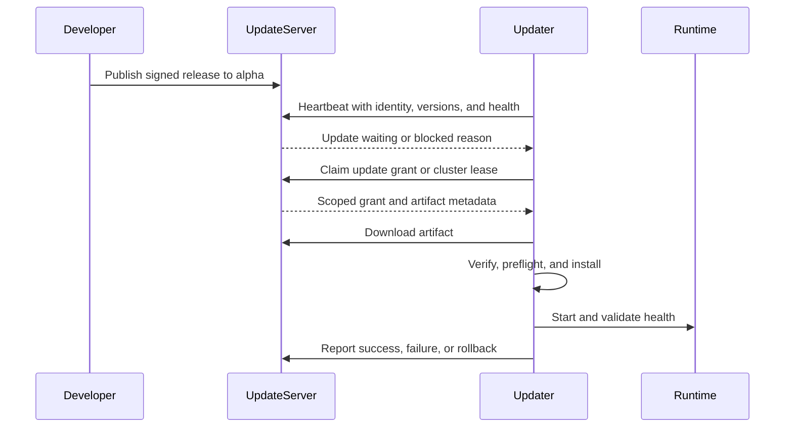
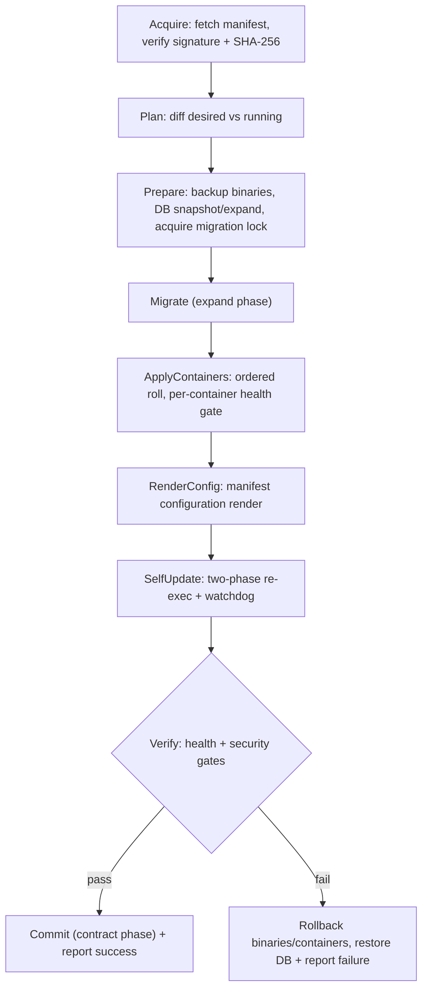

# Update Server and Agent Guidelines

| | |
|---|---|
| **Document Version** | 1.3.0 |
| **Last Updated** | August 18, 2026 |
| **Status** | Draft |
| **Audience** | Platform engineering, release engineering, and operations |
| **Maintained By** | MySoc / SiemCore Platform Team |

---

## 1. Purpose

This document defines the required operating model for publishing and delivering
MySoc and SiemCore updates. It covers:

- The central Updates Server at `updates.mysoc.ai`
- Updater agents on standalone Linux servers
- Updater agents on every node in a SiemCore cluster
- Target-state updater agents on Windows, macOS, and Linux workstations
- The engineering release and promotion cycle
- Security, reliability, rollback, and operational requirements

The goal is one consistent control protocol with topology-specific local
execution.

### 1.1 Normative Terms

- **MUST**: required for correctness or security.
- **SHOULD**: expected unless a documented exception exists.
- **MAY**: optional.

### 1.2 Capability Labels

This guideline describes both current and target behavior:

- **Current** means implemented in this repository.
- **Target** means required behavior that may still need implementation.

Do not advertise target behavior as available until it has passed the release
and operational validation defined here.

---

## 2. Core Principles

1. Every managed machine runs its own updater agent.
2. All control traffic is initiated by the updater over outbound HTTPS.
3. The Updates Server authorizes and coordinates updates; it does not install
   software remotely.
4. The updater downloads directly from the authorized artifact source and owns
   local installation, validation, and rollback.
5. SiemCore exposes health, readiness, schema, and local lifecycle hooks, but
   does not select or authorize its own version.
6. Company administrators retain control over approval policy, rollout rings,
   maintenance windows, and reboot behavior.
7. Releases are immutable, signed, auditable, and promoted without replacing
   their artifacts.
8. No updater may update concurrently with another updater process or local
   recovery action on the same machine.
9. Cluster updates are coordinated through grants and leases, never through
   SSH or peer-to-peer orchestration.

---

## 3. Responsibility Boundaries

### 3.1 Developer and Release Engineer

The release owner MUST:

- Obtain code review and pass required CI checks.
- Assign a semantic version.
- Build reproducible artifacts for supported targets.
- Run unit, integration, migration, upgrade, and rollback tests.
- Produce a release manifest, checksums, signatures, and an SBOM.
- Publish first to the `alpha` rollout ring.
- Record release notes, compatibility constraints, and rollback instructions.
- Promote the same artifact through later rings after exit criteria pass.

The release owner MUST NOT deploy directly to customer production systems.

### 3.2 Company Administrator

The company administrator owns:

- Device and cluster enrollment approval
- Automatic versus manual update policy
- Maintenance and reboot windows
- Rollout-ring assignment
- Production approval
- Emergency pause and rollback approval

Company policy may be stricter than the platform default. The Updates Server
MUST enforce the stricter effective policy.

### 3.3 Updates Server

The Updates Server owns:

- Company, device, cluster, and node registry
- Release metadata and immutable artifact distribution
- Channel, rollout-ring, and compatibility policy
- Heartbeat evaluation and update offers
- Device-scoped update grants
- Cluster rollout and schema-migration leases
- Audit history, rollout status, and operator controls
- Grant pause, revocation, and expiry

The Updates Server MUST NOT:

- Open inbound connections to managed machines
- SSH to nodes
- Provision infrastructure
- Promote PostgreSQL or Redis
- Modify customer runtime configuration directly
- Trust a `company_id` supplied by an unauthenticated request

### 3.4 Updater Agent

The updater owns:

- Enrollment and secure credential storage
- Heartbeat and status reporting
- Local policy and preflight validation
- Grant claiming
- Artifact download and cryptographic verification
- Service stop/start, package replacement, and migrations
- Health validation and rollback
- Durable result reporting
- Safe self-update

An updater on one node MUST NOT control another node.

### 3.5 SiemCore Runtime and Infrastructure

SiemCore supplies:

- `/health/live` and `/health/ready` signals
- Running version and schema version
- Drain or quiesce hooks where required
- Migration compatibility and runtime status

Infrastructure and HA systems retain responsibility for:

- VM, network, storage, DNS, and load balancer provisioning
- PostgreSQL promotion and replication
- Redis Sentinel or Kafka coordination
- Runtime failover and quorum

---

## 4. Identity, Enrollment, and Tenant Isolation

### 4.1 Company Ownership

Every device MUST belong to exactly one company. The server MUST derive company
ownership from the authenticated enrollment or device credential, not from a
mutable heartbeat field.

Company-scoped operators MUST only see and control devices, clusters, releases,
and audit events authorized for their company.

### 4.2 Device Identity

Every updater MUST have:

- A stable `device_id`
- A per-device credential
- An instance type and topology
- OS and architecture information
- A credential issuance and expiry record

Cluster nodes additionally MUST have:

- `cluster_id`
- Immutable `node_id`
- Immutable role such as `app`, `db`, `witness`, or `loadgen`
- Event bus and topology profile

Reinstalling a device SHOULD use an explicit re-enrollment flow. It MUST NOT
silently reuse another device's identity.

### 4.3 Credentials

- Enrollment tokens MUST be single-use or short-lived.
- Device credentials MUST be unique, revocable, and rotatable.
- Credentials MUST be stored using operating-system protected storage with
  restrictive file or service permissions.
- API keys, license keys, bearer tokens, and grants MUST NOT appear in URLs,
  query strings, logs, or process arguments.
- A device credential MUST NOT authorize release publication or administration.

### 4.4 Product Hierarchy (mysoc > siemcore > swf)

Products form a canonical three-tier tree owned by a single customer:

| Tier       | Rank | Parent tier | Notes                                  |
| ---------- | ---- | ----------- | -------------------------------------- |
| `mysoc`    | 0    | *(none)*    | Root; one per customer                 |
| `siemcore` | 1    | `mysoc`     | Many per mysoc                         |
| `swf`      | 2    | `siemcore`  | Many per siemcore (Windows forwarder)  |

Rules:

- A customer owns **one license** that spans the whole tree. Every node presents
  the **same** `X-License-Key`; the server binds each node's `license_id` from
  that key and groups the fleet by customer/license.
- Agents **self-report** their tier and their parent via `product_tier` and
  `parent_instance_id` on every heartbeat and update-check. `instance_type`
  remains the OS/sub-type; `product_tier` is the canonical tier.
- The server MUST validate a supplied `product_tier` against the canonical set
  and, when the declared parent already exists, MUST assert the parent's tier is
  exactly one rank above. A child MAY enroll before its parent; the server stores
  the link and treats the node as an *orphan* in the tree until the parent
  appears (it MUST NOT reject purely because the parent is unknown).
- Self-reported parentage is a topology convenience for grouping and display. It
  is NOT an authorization boundary: company ownership is still derived from the
  authenticated credential (§4.1), and a device credential still MUST NOT
  authorize administration (§4.3).

Operators view the assembled tree via `GET /api/v1/instances/tree` (grouped
`license -> mysoc -> siemcore -> swf`, with orphan and unlicensed buckets) or the
dashboard's Instances → Tree view. The canonical tier catalog is served at
`GET /api/v1/products`.

---

## 5. Release Channels and Rollout Rings

Channels and rollout rings are separate controls.

### 5.1 Channels

Channels describe build stability:

- `nightly`: automated development builds
- `beta`: release candidates
- `stable`: approved release line

### 5.2 Rollout Rings

Rollout rings describe who may receive a release:

- `alpha`: internal testing
- `beta`: staging and pre-production
- `stable`: legacy/default general ring
- `production`: explicitly approved customer production

A stable channel does not imply production approval.

New devices SHOULD receive an explicit rollout ring during enrollment. The
legacy `stable` default MUST NOT be added to an alpha release merely to make
unclassified devices see it. Existing guidance to "always include stable" is a
compatibility workaround, not a safe staged-rollout policy.

Production devices MUST default to manual approval unless the company has
explicitly enabled automatic production updates.

---

## 6. Developer Release Cycle

### 6.1 Source, Branch, and Build Identity

`main` MUST be the single source of truth for the exact source commit and build
running in production. Development MUST NOT be performed directly on `main`.

Each release starts from current `main` on a branch named:

```text
version/MAJOR.MINOR.PATCH
```

For example, release `1.1.0` is developed on `version/1.1.0`.

Every release artifact build MUST have a unique four-part identifier:

```text
MAJOR.MINOR.PATCH.BUILD
```

The first candidate for release `1.1.0` is `1.1.0.1`; each rebuilt candidate
increments the final number. A build identifier is immutable and MUST NOT be
reused for different source or artifacts.

### 6.2 Prepare

Before publication, the release owner MUST:

1. Complete code review.
2. Pass lint, build, unit, integration, and security checks.
3. Test supported upgrade paths and rollback.
4. Validate migrations with production-representative data.
5. Confirm backward compatibility for rolling cluster updates.
6. Assign `MAJOR.MINOR.PATCH` according to semantic versioning.
7. Document supported source versions and minimum updater version.

### 6.3 Build

CI SHOULD produce:

- Platform and architecture-specific artifacts
- A universal cluster bundle where required
- A machine-readable manifest
- SHA-256 checksums
- Cryptographic signatures
- An SBOM
- Release notes
- Build provenance linking the artifact to source and CI execution

Build outputs MUST be immutable. Rebuilding or replacing an artifact under the
same version is prohibited.

### 6.4 Local Validation and Deployment Gate

Before any production upload or deployment, the release owner MUST locally run
all relevant formatting, lint, build, unit, integration, upgrade, rollback, and
smoke checks.

Deployable candidates MUST be built from a clean committed tree. A build marked
`dirty` is diagnostic only and cannot be uploaded or deployed.

After local validation succeeds, work MUST stop. The release owner reports the
branch, commit, build number, and test results, then waits for explicit
deployment instructions. Successful testing does not authorize deployment.

No merge to `main`, production artifact upload, service restart, or deployment
to `updates.mysoc.ai` may occur while waiting.

When explicit deployment approval is received, only the exact tested build may
be merged to `main` and deployed. Any material change invalidates the approval
and requires a new build number and a complete local validation cycle.

### 6.5 Publish

The release owner uploads the artifact and metadata to the Updates Server using
an administrative release credential. The initial target ring MUST be `alpha`.

Publishing creates availability; it does not authorize every device to install.

### 6.6 Promote

Promotion changes release policy metadata while retaining the exact artifact:

1. `alpha`: internal update and rollback validation
2. `beta`: staging, load, migration, and operational validation
3. `stable`: approved general rollout where this ring is used
4. `production`: explicit production approval

The Day 1 / Day 3 / Day 7+ cadence in the deployment guide is a default
reference. Objective exit criteria take precedence, and operators MAY extend
any soak period.

Promotion MUST stop when any of these occur:

- Artifact verification failure
- Unexpected rollback
- Material health regression
- Migration failure
- Error-rate or performance regression
- Cluster health or quorum degradation
- Unexplained device cohort divergence

### 6.7 Complete

After production promotion, the release owner MUST record:

- Ring promotion times and approvers
- Number of eligible, updated, failed, deferred, and rolled-back devices
- Cluster rollout and migration results
- Open exceptions
- Final release status

---

## 7. Heartbeat-Driven Update Protocol

The heartbeat response is the update signal. It is not an inbound server push.



### 7.1 Heartbeat

An updater SHOULD send a heartbeat every 60 seconds with server-provided jitter
or at the configured interval. A heartbeat reports:

- Device, instance, topology, node, and role identity
- Updater, product, and schema versions
- OS and architecture
- Service and application health
- Current update state and active grant ID
- Last update result
- Required operational metrics

The server authenticates the device, derives company ownership, evaluates
policy, and responds with one of:

- `none`: no eligible update
- `waiting`: an eligible update may be claimed
- `approval_required`: a release exists but company approval is missing
- `blocked`: health, compatibility, topology, or lease policy prevents update
- `paused`: rollout is paused by an operator

### 7.2 Illustrative Target Response

The following shape is illustrative target behavior, not a claim that the
current endpoint implements this contract:

```json
{
  "server_time": "2026-08-10T04:00:00Z",
  "next_heartbeat_seconds": 60,
  "update": {
    "state": "waiting",
    "release_id": "rel_01JXYZ",
    "product": "siemcore",
    "target_version": "3.1.0",
    "strategy": "standalone",
    "claim_required": true
  }
}
```

### 7.3 Grant Claim

Before downloading, the updater MUST claim an authorized grant. A grant MUST
be:

- Scoped to one company, device, release, version, and artifact
- Short-lived
- Idempotent when retried by the same device
- Revocable
- Audited
- Bound to a rollout strategy

Cluster grants additionally carry a lease identity and expiry. The server MUST
not grant conflicting work while a valid lease is active.

An illustrative target grant contains:

```json
{
  "grant_id": "grant_01JXYZ",
  "release_id": "rel_01JXYZ",
  "expires_at": "2026-08-10T04:15:00Z",
  "download_url": "https://updates.mysoc.ai/artifacts/rel_01JXYZ",
  "sha256": "sha256:...",
  "signature": "...",
  "strategy": "rolling-app"
}
```

### 7.4 Download and Verification

The updater MUST verify, before changing the installed system:

- Grant scope and expiry
- Manifest signature
- Artifact checksum and signature
- Product, topology, role, OS, and architecture compatibility
- Allowed source-version range
- Minimum updater version
- Schema compatibility
- Available disk space
- Maintenance and reboot policy

Verification failure MUST fail closed and MUST be reported.

### 7.5 Result Reporting

The updater MUST report durable state transitions:

```text
idle
  -> offered
  -> claimed
  -> downloading
  -> verifying
  -> installing
  -> validating
  -> succeeded
```

Failures transition to `failed` before activation or to `rolled_back` after an
installation has changed the running system. Reports MUST include the grant,
release, source and target versions, timestamps, stage, error code, and sanitized
details.

---

## 8. Agent Safety Requirements

Every updater implementation MUST satisfy these invariants:

### 8.1 Process and Concurrency

- Hold a single-instance process lock.
- Serialize all update paths with one update-operation lock.
- Continue heartbeats during long updates without starting another update.
- Prevent watchdog, scheduled, manual, and emergency paths from updating
  concurrently.
- Debounce recovery actions and cap restart attempts.

### 8.2 Download and State Durability

- Download to a unique temporary path.
- Support safe retry or resume where practical.
- Check all read and write errors.
- Flush critical files before activation.
- Use atomic rename or an OS-native transactional installer.
- Persist grant and update state atomically.
- Recover deterministically after power loss or process termination.

### 8.3 Service Lifecycle

- Poll for service stop completion with a bounded timeout.
- Do not rely on fixed sleeps.
- Preserve the previous executable, image, or package until validation passes.
- Start services in dependency order.
- Validate liveness, readiness, expected version, and required dependencies.
- Roll back automatically when post-install validation fails.

### 8.4 Database Migrations

- Use a database advisory lock to prevent concurrent migration execution.
- Verify migration checksums.
- Run preflight validation.
- Prefer expand/contract migrations compatible with rolling deployments.
- Do not apply automatic destructive down migrations.
- Record schema version and migration outcome.

A database advisory lock prevents duplicate migration execution. It is not a
replacement for a cluster rollout lease.

### 8.5 Self-Update

Updater self-update MUST:

- Verify the new updater before replacement.
- Use a helper or OS-native mechanism that can replace a running executable.
- Stop new work and exit gracefully.
- Preserve configuration and credentials.
- Confirm the new updater starts and heartbeats.
- Restore the previous updater if startup validation fails.

### 8.6 Retry Policy

- Retry transient network failures with exponential backoff and jitter.
- Do not retry permanent authorization, compatibility, or signature failures.
- Honor server retry guidance.
- Never loop indefinitely without reporting a degraded state.

### 8.7 Desired-State Manifest (`system-template.json`)

A single release describes far more than one binary: it may change code,
database schema, a set of containers, rendered configuration, and the updater
itself. The agent MUST treat one signed **desired-state manifest**
(`system-template.json`) as the unit of work and reconcile the machine toward it,
rather than applying each concern through an independent code path.

The manifest MUST be:

- Fetched over the authorized channel and verified (signature and per-artifact
  SHA-256) before any action.
- Schema-validated, including unique container names, resolvable dependencies,
  and an acyclic dependency graph.
- Diffed against current state to produce an ordered plan; when current already
  equals desired, the agent MUST take no action.
- Applied transactionally, keeping the prior manifest and restore point until
  the change is committed.

Illustrative schema (**Target**):

```json
{
  "schema_version": 1,
  "product": "siemcore",
  "release": "2.2.0",
  "required_db_schema": "2025.08.11-0007",
  "self_update": { "version": "mysoc-updater/2.2.0", "url": "/api/v1/releases/mysoc-updater/2.2.0/download", "sha256": "..." },
  "containers": [
    { "name": "siemcore-db", "image": "registry.mysoc.ai/siemcore/postgres", "version": "15.6", "strategy": "recreate", "health": "pg_isready" },
    { "name": "siemcore-api", "image": "registry.mysoc.ai/siemcore/api", "version": "2.2.0", "depends_on": ["siemcore-db"], "strategy": "rolling", "health": "http://127.0.0.1:8080/health" }
  ],
  "config_templates": [ { "path": "/opt/siemcore/config/siemcore.yaml", "sha256": "..." } ],
  "signature": "..."
}
```

### 8.8 Reconcile Pipeline

The agent MUST apply a manifest through a staged, health-gated,
rollback-capable pipeline. Each stage runs only after the previous stage
succeeds; any failure triggers rollback of the prior stages and a failure
report.



### 8.9 Code Change Application

For any executable, image, or package change the agent MUST:

- Verify the artifact SHA-256 **and** release signature before activation.
  (**Current gap**: the bundled Linux updater in
  [internal/updater/update/checker.go](../internal/updater/update/checker.go)
  downloads and swaps the binary without verifying the advertised checksum; the
  simulator client enforces it. This MUST be closed before checksum enforcement
  is described as implemented.)
- Activate atomically (atomic rename or an OS-native transactional installer).
- Retain the previous artifact as a restore point until health and security
  gates pass.
- Commit only after post-change verification succeeds.

### 8.10 Multi-Container Orchestration

When a product is delivered as multiple containers, the agent owns their
lifecycle directly (for example through Compose or a pod set). The agent MUST:

- Start and stop containers in dependency order derived from `depends_on`.
- Apply each container according to its `strategy` (`rolling` or `recreate`).
- Gate promotion of each container on its readiness/health check.
- Roll the set back to the prior images when any container fails its gate.

### 8.11 Boot Sequence and Signal Handling

The agent MUST manage orderly startup and shutdown:

- Start managed services in dependency order and wait for readiness, not fixed
  sleeps.
- On `SIGTERM`/`SIGINT`, stop scheduling new update work, allow the in-flight
  operation a bounded drain window, then escalate to forced termination.
- Never begin a new update while a shutdown is in progress.
- Recover deterministically after power loss, including finishing or reversing a
  self-update marked in durable state.

### 8.12 Health and Security Gates

Post-change health and security checks are **commit gates**, not advisory:

- Verify liveness, readiness, and expected versions before commit.
- Verify the post-change security posture (for example firewall, hardening, and
  file-integrity expectations) before commit.
- On any gate failure, roll back and report the failing stage.

### 8.13 Update Monitoring and Telemetry

The agent MUST make update progress observable:

- Track a per-stage update state machine (prepare, migrate, containers, config,
  self-update, health, security, commit).
- Report the current stage and outcome on the heartbeat and result endpoints,
  distinguishing single-artifact updates from manifest reconciliation.
- Persist the last reconcile outcome durably so a restarted agent and the server
  can recover the last known state.

---

## 9. Topology-Specific Behavior

### 9.1 Standalone Linux Server

The updater owns the complete local upgrade:

1. Receive an offer through heartbeat.
2. Claim a device grant.
3. Verify compatibility and maintenance policy.
4. Download and verify the artifact.
5. Create a restorable backup.
6. Stop the managed service safely.
7. Apply migrations and replace the application.
8. Start and health-check the application.
9. Commit the version or roll back.
10. Report the result.

Production standalone servers SHOULD require explicit approval.

### 9.2 SiemCore Cluster

Every cluster node runs an updater. There is no single updater that SSHs to or
directly controls the other nodes.

Each node reports immutable identity and role. The Updates Server evaluates
cluster-wide health and grants work in this order:

1. Validate topology, event bus, role inventory, versions, schema, and quorum.
2. Grant exactly one migration lease for the target schema.
3. Wait for successful migration reporting.
4. Grant one app-node update at a time.
5. Require readiness and expected-version validation before advancing.
6. Handle DB-node updates as separately approved operations.
7. Update witness nodes only when quorum is healthy and no failover is active.

The server MUST block rollout when:

- Required roles are missing
- The cluster is unhealthy
- Replication or quorum is degraded
- Failover is active
- Schema versions are incompatible
- Another rollout or migration lease is active
- The bundle role, topology, or event bus is incompatible

The node updater only executes the role-specific path from the signed universal
bundle. See [SIEMCore Cluster Update Server Spec](SIEMCORE-CLUSTER-UPDATE-SERVER-SPEC.md).

### 9.3 Windows, macOS, and Linux Workstations

Workstation agents use the same enrollment, heartbeat, policy, grant, and report
concepts. Installation is delegated to an OS-specific driver:

- Windows: Windows Service and signed MSI/MSIX or equivalent package
- macOS: launchd and signed/notarized package
- Linux: systemd and signed distribution package or approved bundle

Workstation policy SHOULD support:

- User deferral with a bounded deadline
- Maintenance and quiet hours
- Reboot requirement and deadline
- AC-power and minimum battery checks
- Metered-network restrictions
- Running-application coordination
- Least-privilege execution
- OS-native rollback or package recovery

Workstations MUST NOT receive server or cluster bundles merely because the
product name matches.

---

## 10. Security Requirements

### 10.1 Transport and Network

- All production traffic MUST use TLS.
- Agents MUST validate server identity.
- Enterprise proxies and custom trust stores SHOULD be supported explicitly.
- Only outbound HTTPS is required from managed environments.
- The server SHOULD rate-limit enrollment, heartbeat, claim, and download
  operations.

### 10.2 Artifact Trust

- Release signing keys MUST be separated from upload credentials.
- Signing SHOULD use a protected CI identity, KMS, or equivalent control.
- Agents MUST pin or securely update trusted signing identities.
- Signatures MUST cover the manifest and artifact digest.
- Checksums alone are not proof of publisher identity.
- SBOM and provenance SHOULD be retained with every release.

### 10.3 Authorization

- Release publication requires a dedicated privileged role.
- Company operators may only approve their authorized fleet.
- Device credentials may only heartbeat, claim, download, and report for that
  device.
- Grants MUST be scoped and short-lived.
- Role and tenant changes MUST be audited.
- Revoked credentials MUST be rejected immediately.

### 10.4 Logging

Logs and error reports MUST redact:

- License keys
- Device API keys
- Bearer and refresh tokens
- Grant tokens
- Customer secrets
- Sensitive configuration values

---

## 11. Observability and Audit

The Updates Server SHOULD expose:

- Last heartbeat and connectivity state
- Current and desired versions
- Update ring, channel, and effective policy
- Update state and stage duration
- Grant and cluster lease status
- Last success, failure, and rollback
- Cluster health and schema convergence
- Workstation deferral and reboot state

Alert on:

- Missing heartbeats beyond the configured threshold
- Signature or checksum failures
- Repeated update or rollback failures
- Stuck grants or cluster leases
- Version or schema drift
- Unexpected device identity changes
- Production rollout without approval
- Cluster health degradation during rollout

Audit events MUST identify the actor, company, device or cluster, release,
action, previous value, new value, timestamp, and result.

---

## 12. Operational Runbooks

### 12.1 Publish and Promote

1. Confirm CI, manifest, signing, SBOM, and rollback evidence.
2. Publish the immutable artifact to `alpha`.
3. Confirm alpha devices claim, install, and remain healthy.
4. Promote the same release to `beta`.
5. Validate staging and cluster behavior.
6. Promote to `stable` where applicable.
7. Obtain explicit production approval.
8. Promote to `production` and monitor until completion.

### 12.2 Pause a Rollout

1. Stop issuing new grants for the affected release and ring.
2. Do not delete the artifact.
3. Allow safely executing agents to complete or follow the documented abort
   policy.
4. Investigate failed stages and affected cohorts.
5. Resume only after approval and corrective evidence.

### 12.3 Roll Back

1. Pause new grants.
2. Identify the last known-good version.
3. Issue an explicit rollback action where supported, or invoke the local
   break-glass rollback.
4. Validate service and data compatibility.
5. Confirm heartbeats report the restored version.
6. Record the incident and disposition of the failed release.

Deleting a release is not a rollback mechanism.

### 12.4 Stuck Cluster Lease

1. Confirm the node is not still applying an update.
2. Inspect its last heartbeat and local update status.
3. Do not grant another node conflicting work while the lease may still be
   active.
4. Expire or revoke the lease only through an audited operator action.
5. Re-evaluate cluster health before continuing.

### 12.5 Lost or Compromised Agent

1. Pause grants to the device.
2. Revoke its credential.
3. Investigate identity, heartbeat, and audit history.
4. Re-enroll with a new credential after the machine is trusted.
5. Rotate affected company credentials if exposure cannot be bounded.

---

## 13. Checklists

### 13.1 Release Publisher

- [ ] Code review and CI passed
- [ ] Version and compatibility are documented
- [ ] Upgrade and rollback were tested
- [ ] Migrations are safe for the target topology
- [ ] Manifest, checksums, signatures, SBOM, and provenance exist
- [ ] Artifact is immutable
- [ ] Initial ring is `alpha`
- [ ] Monitoring owner and rollback owner are assigned

### 13.2 Updates Server Operator

- [ ] Publisher identity is authorized
- [ ] Release metadata and artifact digest match
- [ ] Target rings and companies are correct
- [ ] Production approval is recorded
- [ ] Grant and cluster lease limits are active
- [ ] Rollout dashboards and alerts are healthy
- [ ] Pause and rollback controls are available

### 13.3 Agent Maintainer

- [ ] Single-instance and update-operation locks are enforced
- [ ] Heartbeat does not trigger concurrent installation
- [ ] Grant, signature, checksum, and compatibility checks fail closed
- [ ] Downloads and status writes are atomic
- [ ] Service lifecycle uses bounded polling
- [ ] Migration and cluster locks have distinct purposes
- [ ] Self-update is recoverable
- [ ] Secrets are redacted
- [ ] Failure, rollback, and interruption tests pass

---

## 14. Current Implementation Status

The repository currently provides:

- Release upload, storage, listing, and download
- SHA-256 calculation during release upload
- License activation and instance registration
- Heartbeat receipt and basic instance inventory
- A Linux/root/systemd-oriented updater
- Local binary backup, replacement, service restart, and manual rollback
- A dashboard for instances, releases, licenses, users, and settings

The updater simulator ([pkg/updatersim](../pkg/updatersim)) additionally provides
a safe, product-agnostic skeleton for the desired-state reconcile model of
Section 8.7-8.13: a `system-template.json` schema with load, validation, and
diff; a staged, health-gated, rollback-capable reconcile pipeline; a two-phase
self-update with watchdog recovery; graceful signal draining; and per-stage
telemetry. All stages delegate to a `ReconcilingExecutor` seam that defaults to a
no-op so nothing on the host is changed. Product teams (SiemCore, SWF) implement
that seam to make the model real.

The following target requirements are not complete:

- Company-scoped tenant authorization throughout the API
- Enforcement of per-device credentials on heartbeat and update delivery
- Heartbeat response consumption by the bundled updater
- Idempotent device grants and cluster leases
- Agent-side checksum and signature enforcement in the bundled Linux updater
  (the simulator enforces checksums; the production updater in
  [internal/updater/update/checker.go](../internal/updater/update/checker.go)
  does not yet)
- Real (non-simulated) manifest reconciliation: database migration, container
  orchestration, configuration render, and self-update in a product executor
- Durable update-result reporting
- Cluster registry and rolling-update policy
- Windows and macOS workstation agents
- CI release workflows, SBOM, provenance, and release signing

The current server heartbeat can return available updates, but the bundled
updater does not consume that response. It separately checks the public
`/releases/{product}/latest` endpoint, which bypasses the group-aware
`/updates/{product}/check` policy path. New development SHOULD converge these
paths on the heartbeat-offer and grant model before describing central rollout
policy as enforced.

The updater in this repository MUST be treated as a Linux server implementation,
not as evidence of cluster or cross-platform workstation support.

---

## 15. Related Documents

- [Project README](../README.md)
- [Updater Simulator](UPDATER-SIMULATOR.md)
- [SiemCore Deployment Guide](SIEMCORE_DEPLOYMENT_GUIDE.md)
- [MySoc Admin Guide](MYSOC_ADMIN_GUIDE.md)
- [SiemCore Cluster Update Server Spec](SIEMCORE-CLUSTER-UPDATE-SERVER-SPEC.md)
- [Server Deployment Guide](../DEPLOYMENT.md)

